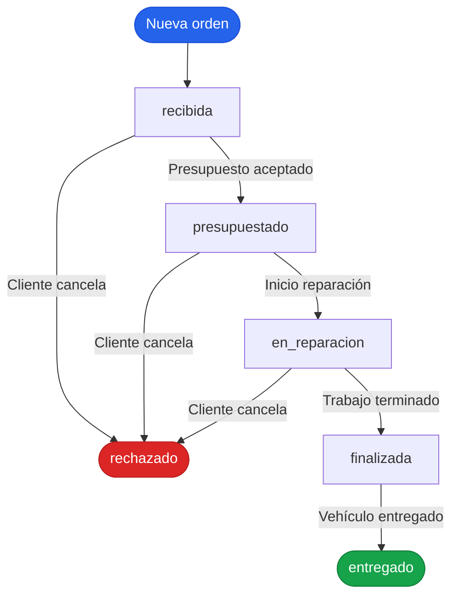
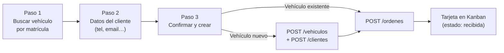

# TallerGest

Aplicación de gestión para talleres mecánicos. Permite administrar clientes, vehículos, órdenes de trabajo y presupuestos mediante un tablero Kanban, con generación de PDFs y configuración del taller.

---

## Tecnologías

| Capa | Stack |
|---|---|
| **Backend** | Python · FastAPI · SQLAlchemy · SQLite · WeasyPrint · Jinja2 |
| **Frontend** | Vue 3 · TypeScript · Vite · Pinia · Tailwind CSS · shadcn-vue |
| **Contrato API** | OpenAPI 3.1.0 (`openapi/spec.yaml`) |
| **Tests** | pytest (backend) · Vitest (frontend) · Playwright (e2e) |

---

## Estructura del proyecto

```
Tp_DSAI/
├── taller-app/
│   ├── backend/
│   │   ├── app/
│   │   │   ├── main.py             # Entry point FastAPI
│   │   │   ├── models.py           # SQLAlchemy models
│   │   │   ├── schemas.py          # Pydantic schemas
│   │   │   ├── crud.py             # Capa de acceso a datos
│   │   │   ├── database.py         # Conexión SQLite
│   │   │   ├── state_machine.py    # Máquina de estados de órdenes
│   │   │   ├── pdf_templates/      # Plantillas Jinja2 para PDF
│   │   │   └── routes/
│   │   │       ├── clientes.py
│   │   │       ├── vehiculos.py
│   │   │       ├── ordenes.py
│   │   │       ├── items.py
│   │   │       ├── pdf.py
│   │   │       └── config.py
│   │   ├── tests/                  # Tests pytest por recurso
│   │   └── requirements.txt
│   ├── frontend/
│   │   └── src/
│   │       ├── views/              # KanbanView, SearchView, AjustesView
│   │       ├── components/         # OrderCard, OrderDetailSheet, dialogs…
│   │       ├── stores/             # Pinia (orders, config)
│   │       ├── composables/        # useSearch, usePolling
│   │       ├── lib/                # api.ts, inputGuards.ts
│   │       └── types/              # Tipos TS generados desde OpenAPI
│   ├── openapi/
│   │   └── spec.yaml               # Contrato API (fuente de verdad)
│   └── e2e-test.js                 # Smoke test Playwright
└── .claude/
    ├── settings.json               # Plugins Claude Code (proyecto)
    └── settings.local.json         # Permisos de comandos Bash
```

---

## Flujo de una orden de trabajo



Los estados `entregado` y `rechazado` son terminales (no admiten más transiciones). Los estados `en_reparacion`, `finalizada`, `entregado` y `rechazado` son de bloqueo (no permiten editar el presupuesto).

---

## Flujo de creación de una orden



---

## API — Recursos principales

| Recurso | Endpoints clave |
|---|---|
| Clientes | `GET /clientes` · `POST /clientes` · `GET /clientes/buscar` |
| Vehículos | `GET /vehiculos` · `POST /vehiculos` · `GET /vehiculos/buscar` |
| Órdenes | `GET /ordenes` · `POST /ordenes` · `PATCH /ordenes/{id}/estado` |
| Items (presupuesto) | `POST /ordenes/{id}/items` · `DELETE /items/{id}` |
| PDF | `GET /ordenes/{id}/pdf` |
| Configuración | `GET /config` · `PUT /config` |

El contrato completo está en [`taller-app/openapi/spec.yaml`](taller-app/openapi/spec.yaml).

---

## Puesta en marcha

### Backend

```bash
cd taller-app/backend
pip install -r requirements.txt
uvicorn app.main:app --reload
# API disponible en http://localhost:8000
# Docs interactivos en http://localhost:8000/docs
```

### Frontend

```bash
cd taller-app/frontend
npm install
npm run dev
# App disponible en http://localhost:5173
```

### Tests

```bash
# Backend
cd taller-app/backend && pytest

# Frontend
cd taller-app/frontend && npm run test

# E2E (requiere backend + frontend corriendo)
node taller-app/e2e-test.js
```

---

## Archivos de configuración

### Claude Code

| Archivo | Scope | Propósito |
|---|---|---|
| `.claude/settings.json` | Proyecto | Habilita el plugin `superpowers` para este proyecto |
| `.claude/settings.local.json` | Proyecto (local) | Permisos de comandos Bash permitidos a Claude Code |
| `~/.claude/settings.json` | Usuario global | Habilita el plugin `frontend-design` en todas las sesiones |

### Frontend

| Archivo | Propósito |
|---|---|
| `frontend/vite.config.ts` | Bundler: alias `@/`, proxy `/api` → backend |
| `frontend/tailwind.config.js` | Tokens de diseño: colores, fuentes, animaciones |
| `frontend/tsconfig.app.json` | Compilador TypeScript (paths, strict mode) |
| `frontend/components.json` | Registro de componentes shadcn-vue instalados |
| `frontend/.env` | Variables de entorno (`VITE_API_BASE_URL`) |
| `frontend/.env.example` | Plantilla de variables de entorno |

### Backend

| Archivo | Propósito |
|---|---|
| `backend/requirements.txt` | Dependencias Python |

### API / Contrato

| Archivo | Propósito |
|---|---|
| `taller-app/openapi/spec.yaml` | Especificación OpenAPI 3.1.0 — fuente de verdad para endpoints y tipos TS |

---

## Skills de Claude Code utilizadas

Este proyecto se desarrolló con el plugin **superpowers v5.1.0** y **frontend-design**. Las skills invocadas durante el desarrollo:

| Skill | Cuándo se usó |
|---|---|
| `brainstorming` | Diseño inicial de la arquitectura y exploración de enfoques |
| `writing-plans` | Elaboración del plan de implementación en 30 tareas |
| `executing-plans` | Ejecución secuencial de las tareas del plan |
| `systematic-debugging` | Diagnóstico de bugs (TypeError en `año.trim()`, pérdida de foco en búsqueda) |
| `verification-before-completion` | Verificación runtime con Playwright antes de cerrar cada tarea |
| `frontend-design` | Diseño visual del Kanban, diálogos y vistas de ajustes |

### Plan de implementación

El plan activo se encuentra en:

```
~/.claude/plans/ancient-conjuring-platypus.md
```

Contiene el estado actual de las 30 tareas de implementación y cualquier fix pendiente.

---

## Variables de entorno

```env
# frontend/.env
VITE_API_BASE_URL=http://localhost:8000
```
